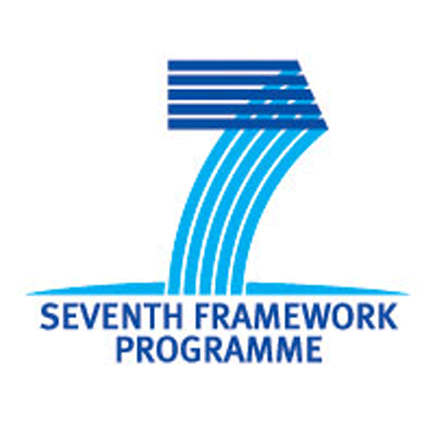
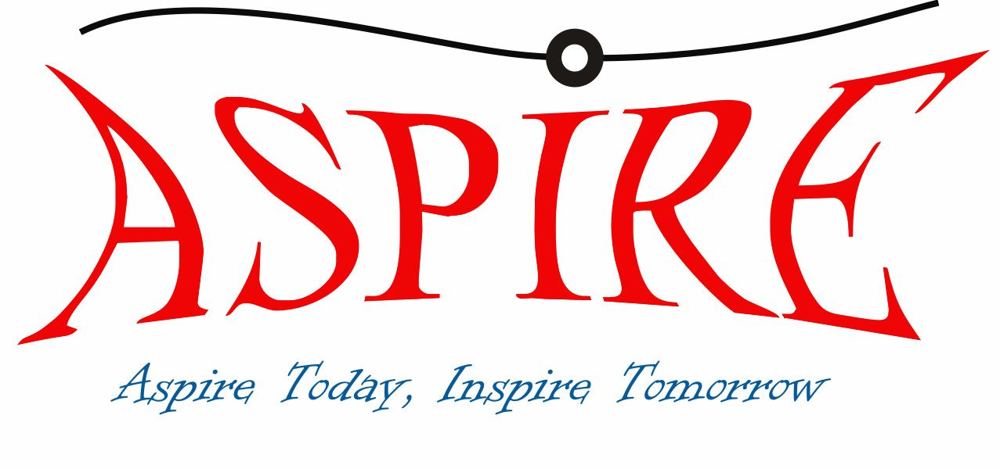
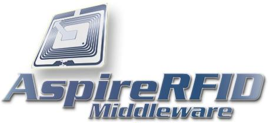

# FP7-ICT Aspire RFID

 

## Advanced Sensors and lightweight Programmable middleware for Innovative Rfid Enterprise applications

https://cordis.europa.eu/project/rcn/85411/factsheet/en

ASPIRE will research and provide a radical change in the current RFID deployment paradigm through innovative, programmable, royalty-free and privacy friendly middleware. This new middleware paradigm will be particular beneficial to European SME, which are nowadays experiencing significant cost-barriers to RFID deployment.

European networked enterprises in general and SME in particular are still reluctant to adopt RFID, since they perceive RFID as unprofitable or too risky. This is largely due to the fact that the adoption of RFID technology incurs a significant Total Cost of Ownership (TCO).

ASPIRE will significantly lower SME entry costs for RFID technology, through developing and providing a lightweight, royalty-free, innovative, programmable, privacy friendly, middleware platform that will facilitate low-cost development and deployment of innovative RFID solutions. This platform will act as a main vehicle for realizing the proposed swift in the current RFID deployment paradigm.

The ASPIRE middleware platform will take into account innovative European developments in the area of ubiquitous RFID-based sensing (i.e., physical quantities sensing (temperature, humidity, pressure, acceleration), mobile sensing) towards enabling novel business cases that ensure high ROI (Return on Investment).

